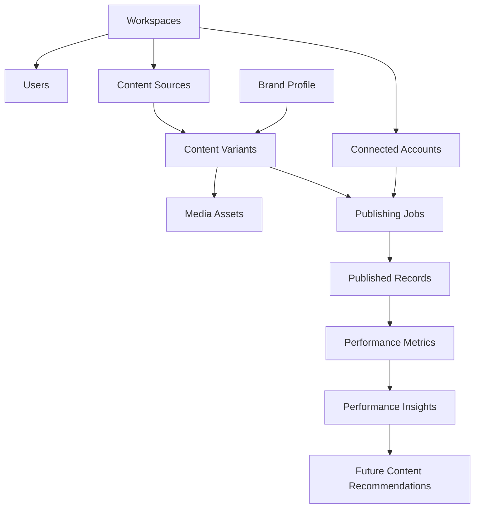
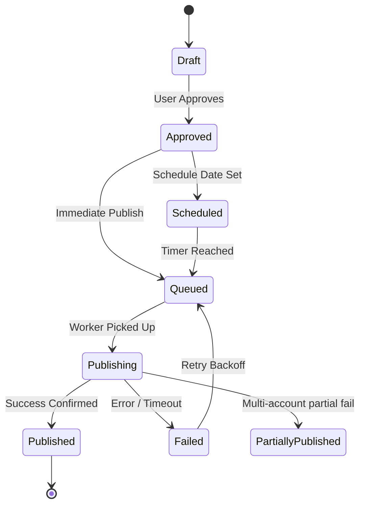

# AI Content Distribution & Repurposing Platform (Lisa)

**Version:** 1.0  
**Status:** Product Definition / Engineering Baseline  
**Product Type:** Multi-tenant SaaS  
**Primary Objective:** Transform one original piece of content into platform-optimized, publishable content across multiple channels, with analytics-driven improvement.  
**Product Principle:** Create once. Adapt intelligently. Publish everywhere possible. Learn from performance.

> **Goal:** Build a reliable content operations system where AI agents perform specialized work, workflows are orchestrated deterministically, and every generated asset can be reviewed, scheduled, published, and tracked—not merely a generic chatbot that writes captions.

---

## 1. Executive Summary

### 1.1 Problem Statement
Content creators, founders, agencies, and marketing teams repeatedly perform the same distribution work:
1. Create an original post.
2. Rewrite it for every platform.
3. Create different captions and hooks.
4. Resize or reformat media.
5. Schedule content separately.
6. Publish manually.
7. Collect performance data.
8. Decide what to create next.

This process is repetitive, fragmented, and difficult to scale. Existing AI writing tools generate text drafts but lack a complete, reliable distribution and feedback loop.

### 1.2 Proposed Solution
The system accepts a single **Content Source** and produces a collection of platform-specific **Content Variants** through an orchestrated pipeline:

```text
ORIGINAL CONTENT
      │
      ▼
CONTENT UNDERSTANDING
      │
      ▼
PLATFORM STRATEGY
      │
      ▼
CONTENT ADAPTATION
      ├── Instagram version
      ├── TikTok version
      ├── YouTube version
      ├── X version
      ├── LinkedIn version
      ├── Threads version
      ├── Facebook version
      ├── Pinterest version
      ├── Email version
      └── Blog version
      │
      ▼
MEDIA PROCESSING
      │
      ▼
QUALITY CONTROL + APPROVAL
      │
      ▼
SCHEDULING / PUBLISHING
      │
      ▼
ANALYTICS COLLECTION
      │
      ▼
PERFORMANCE INSIGHTS
      │
      ▼
NEXT CONTENT RECOMMENDATIONS
```

### 1.3 Product Vision
A creator should be able to say:
> *"Here is my original content. Turn it into a week's worth of platform-native content, prepare everything, and publish the approved versions according to my schedule."*

The platform abstracts operational complexity while keeping the human in complete control of brand identity and final publication.

---

## 2. Product Scope

### 2.1 In Scope
| Capability | Description |
|---|---|
| **Workspace Management** | Users, teams, workspaces, roles & permissions |
| **Brand Management** | Brand voice, target audience, visual identity, rules, knowledge base |
| **Content Ingestion** | Text, images, videos, documents, URLs |
| **Original Content Editor** | Create, edit, and version source content |
| **AI Content Adaptation** | Generate platform-specific native versions |
| **Media Transformation** | Resize, crop, transcode, thumbnail generation, safe zones |
| **Caption & Hook Generation** | Platform-specific captions, hooks, CTAs, hashtags |
| **Content Calendar** | Plan, schedule, reschedule, and visualize content across channels |
| **Approval Workflow** | Review, edit, approve, reject, regenerate |
| **Publishing Integrations** | Connect supported social platforms via OAuth / API |
| **Publishing Execution** | Publish immediately or schedule with idempotency & retries |
| **Publishing Status** | Track queued, processing, published, failed states |
| **Analytics Collection** | Ingest and normalize platform performance metrics |
| **Performance Intelligence** | Compare variants, identify patterns, calculate true engagement |
| **AI Recommendations** | Suggest future content topics and formats based on historical data |
| **Asset Library** | Store and reuse media, derivatives, and content |
| **Audit Logs** | Track sensitive actions, publish events, and workspace changes |
| **Notifications** | Alerts for publishing failures, approvals, token expirations |
| **API & Webhook Architecture** | Extensible integrations and event-driven architecture |

### 2.2 Out of Scope for Initial Release
- Fully autonomous posting without user authorization.
- Automatic replies to comments or DMs.
- Paid advertising campaign execution.
- Autonomous engagement or follow/unfollow actions.
- Buying followers, likes, or engagement.
- Guaranteed viral content promises.
- Full video generation from text (text-to-video).
- Full social listening across every platform.
- Enterprise-level white-label billing complexity.
- Automatic copyright clearance for uploaded media.
- Unrestricted publishing to platforms without approved APIs.

---

## 3. Target Users & Personas

### Persona A: Solo Creator
- **Needs:** Create content once, distribute to multiple platforms, maintain consistent voice, save time, understand what performs.
- **Example:** Tech creator posting educational content on LinkedIn, X, Instagram, YouTube Shorts, and a blog.

### Persona B: Founder / Personal Brand
- **Needs:** Turn thoughts, product updates, and lessons into content; maintain consistent messaging; build authority; schedule in advance.

### Persona C: Marketing Team
- **Needs:** Collaborate on content, adhere to strict brand guidelines, enforce multi-stage approval, track campaign ROI.

### Persona D: Agency
- **Needs:** Multiple clients and workspaces, separate brand settings, client approval workflows, multi-account publishing, consolidated reporting.

---

## 4. Product Goals & Success Metrics

### 4.1 Product Goals
1. Reduce the time required to distribute one content idea across multiple platforms.
2. Produce platform-native content rather than crude copy-paste transformations.
3. Make publishing reliable, idempotent, and observable.
4. Keep the user in control of brand identity and final approval.
5. Create a feedback loop between content performance and future recommendations.
6. Build an extensible agent architecture rather than a collection of hardcoded prompts.

### 4.2 Success Metrics
| Metric | Initial Target |
|---|---|
| **Time to generate 5 platform variants** | < 2 minutes under normal load |
| **Successful generation jobs** | ≥ 98% (excluding provider outages) |
| **Publishing job observability** | 100% of jobs have status + error state |
| **Duplicate publishing prevention** | 100% via idempotency controls |
| **Scheduled job execution** | ≥ 99% within configured execution window |
| **Asset processing success** | ≥ 98% for supported formats |
| **User approval traceability** | 100% of published variants linked to approval state |
| **Analytics sync visibility** | Last sync timestamp for every connected account |
| **API p95 latency for standard reads** | < 500 ms target |
| **Critical job retry handling** | Automatic retry with bounded backoff |

---

## 5. Core Product Concepts



- **Content Source:** The original piece of content created or uploaded by the user (canonical source, not a platform-specific draft).
- **Content Variant:** A platform-specific representation derived from the source, with its own text, media derivatives, metadata, and status.
- **Publishing Job:** A durable, trackable request to publish a specific approved variant to a specific connected account.
- **Published Record:** The historical record linking a variant to an external platform post ID and URL.
- **Performance Metrics:** Raw and normalized analytics ingested from published records over time.

---

## 6. Functional Requirements

### 6.1 Authentication and Workspace Management
- **FR-AUTH-001 (User Registration):** Support email/password, OAuth providers, email verification.
- **FR-AUTH-002 (Authentication):** Support secure login/logout, session management, password reset, token refresh, account deactivation.
- **FR-AUTH-003 (Workspaces):** Support workspace creation, renaming, member invites, removals, switching, and settings management.
- **FR-AUTH-004 (Roles & Permissions):**
  | Role | Permissions |
  |---|---|
  | **Owner** | Full workspace control, billing, deletion |
  | **Admin** | Manage settings, members, integrations |
  | **Editor** | Create, edit, generate, schedule content |
  | **Reviewer** | Review and approve content |
  | **Viewer** | Read-only access to content and analytics |
- **FR-AUTH-005 (Multi-Tenancy):** All workspace-owned resources isolated by `workspace_id`. Server-side tenant checks on every protected resource.

---

## 7. Brand Intelligence System

### 7.1 Brand Profile Fields
| Field | Description |
|---|---|
| **Brand Name** | Name of creator or organization |
| **Description** | What the brand does |
| **Industry** | Industry / category |
| **Target Audience** | Audience personas and pain points |
| **Brand Mission** | Core purpose and values |
| **Tone** | Professional, casual, technical, witty, etc. |
| **Writing Style** | Sentence length, vocabulary, structure |
| **Preferred Language** | English, Hindi, Hinglish, Spanish, etc. |
| **Forbidden Phrases** | Prohibited words/phrases to strictly avoid |
| **Preferred Phrases** | Reusable signature phrases / slogans |
| **CTA Style** | Soft, direct, educational, promotional |
| **Emoji Policy** | None, limited, expressive |
| **Hashtag Policy** | Required, optional, prohibited |
| **Content Pillars** | Core topics the brand consistently covers |
| **Competitors / References** | Reference brands for stylistic cues |
| **Visual Guidelines** | Hex colors, typography, composition guidelines |
| **Disclosure Rules** | Sponsored, AI-generated, affiliate disclosures |

### 7.2 Brand Knowledge Base
- **FR-BRAND-001:** Users can upload brand reference docs (PDFs, Markdown, text, previous posts, FAQs).
- **FR-BRAND-002:** System extracts, chunks, and indexes text in a vector database.
- **FR-BRAND-003:** AI generation retrieves relevant brand context using RAG.
- **FR-BRAND-004:** Users can tag reference examples as Approved, Rejected, or Reference Only.
- **FR-BRAND-005 (Security):** Uploaded docs treated as untrusted knowledge data; prompt injection defenses prevent overriding core system instructions.

---

## 8. Content Ingestion & Source Creation

### 8.1 Supported Source Types
- **Text:** Plain text, rich text, Markdown, long-form articles, notes, product announcements.
- **Media:** Images, videos, audio (with transcription), multi-image assets.
- **External Sources:** Public URLs (article scraping), uploaded documents, imported drafts, RSS feeds (later phase).

### 8.2 Source Creation Requirements
- **FR-SOURCE-001:** Create content source manually via rich-text editor.
- **FR-SOURCE-002:** Upload source files and documents.
- **FR-SOURCE-003:** Attach one or more media assets.
- **FR-SOURCE-004:** Specify metadata: title, objective, target audience, content pillar, desired platforms, campaign, language, target date.
- **FR-SOURCE-005:** Auto-save drafts.
- **FR-SOURCE-006:** Version history tracking on sources.
- **FR-SOURCE-007:** Reusable sources for generating additional variants in the future.

---

## 9. AI Agent Architecture

### 9.1 Separation of Concerns

```text
Agent (LLM Reasoning)
  ↓
Structured Output (JSON)
  ↓
Schema Validation (Pydantic / Zod)
  ↓
Policy / Business Validation
  ↓
Human Approval (if required)
  ↓
Application Service
  ↓
Database / Queue / External API
```

> **Rule:** Agents reason and propose structured outputs. Application services validate and execute those outputs. No LLM agent is given direct API publishing credentials.

### 9.2 Specialized Agent Roster

#### Agent 1: Content Intake Agent
- **Purpose:** Analyze original source and extract a canonical brief.
- **Output Schema:**
```json
{
  "content_brief": {
    "core_idea": "String",
    "summary": "String",
    "content_type": "educational | announcement | case_study | story | opinion",
    "target_audience": ["developers", "founders"],
    "content_pillars": ["AI", "productivity"],
    "key_points": ["Point 1", "Point 2"],
    "tone": "educational",
    "primary_cta": "String",
    "claims_requiring_review": []
  }
}
```

#### Agent 2: Platform Strategy Agent
- **Purpose:** Determine platform-specific angle, format, hook style, length, and media recommendations.
- **Output Schema:**
```json
{
  "platform_strategies": [
    {
      "platform": "linkedin",
      "format": "text_post",
      "angle": "practical lesson",
      "hook_style": "contrarian",
      "cta": "discussion",
      "media_required": false
    }
  ]
}
```

#### Agent 3: Content Adaptation Agent
- **Purpose:** Rewrite source into platform-native copy adhering to brand rules and platform constraints.
- **Rule:** Adapt the content, not the facts. Do not invent statistics, customer results, or claims.

#### Agent 4: Caption & Hook Agent
- **Purpose:** Generate platform-specific hooks, captions, hashtags, and disclosures.
- **Output Schema:**
```json
{
  "caption_package": {
    "primary_caption": "String",
    "alternative_captions": ["Option A", "Option B"],
    "hook": "Strong opening line",
    "cta": "Engaging call to action",
    "hashtags": ["#AI", "#Productivity"],
    "disclosures": []
  }
}
```

#### Agent 5: Media Direction Agent
- **Purpose:** Determine optimal aspect ratio, crop strategy, and framing for each platform.
- **Output Schema:**
```json
{
  "media_plan": {
    "source_asset_id": "asset_123",
    "outputs": [
      {
        "platform": "instagram",
        "format": "feed_portrait",
        "aspect_ratio": "4:5",
        "crop_strategy": "center_subject"
      },
      {
        "platform": "youtube",
        "format": "thumbnail",
        "aspect_ratio": "16:9",
        "crop_strategy": "subject_left_text_right"
      }
    ]
  }
}
```

#### Agent 6: Media Processing Service / Worker (Deterministic)
- **Purpose:** Execute resizing, cropping, transcoding, thumbnail extraction, and preview generation using FFmpeg / Sharp / Pillow.

#### Agent 7: Quality Assurance Agent (QualityEvaluator)
- **Purpose:** Automated compliance, brand voice, source fidelity, grammar, originality, platform formatting, hook strength, and safety review using an objective 10-point scorecard.
- **10-Point Scorecard Criteria:**
  1. `source_fidelity`: Verifies claims, facts, and takeaways match the source without hallucinations.
  2. `brand_voice`: Enforces tone, vocabulary, style guide, and persona consistency.
  3. `grammar_syntax`: Checks syntax, punctuation, flow, and sentence completeness.
  4. `platform_formatting`: Enforces platform character bounds, line breaks, emojis, and hashtags.
  5. `hook_strength`: Assesses first 2-3 lines for stopping power, curiosity, or value proposition.
  6. `specificity`: Penalizes vague generalizations, rewarding concrete facts and metrics.
  7. `usefulness`: Ensures actionable, educational, or entertaining reader takeaway.
  8. `originality`: Detects and bans generic clichés (e.g., *"In today's fast-paced world"*).
  9. `cta_quality`: Evaluates natural alignment and clarity of the call-to-action.
  10. `policy_compliance`: Validates safety, spam filter avoidance, and platform policy adherence.
- **Output Schema (`QualityCheckResult`):**
```json
{
  "quality_score": 0.92,
  "passed": true,
  "requires_human_review": false,
  "checks": [
    { "name": "source_fidelity", "status": "pass", "score": 0.95, "reason": "Accurately reflects core thesis and statistics." },
    { "name": "brand_voice", "status": "pass", "score": 0.90, "reason": "Matches confident, authoritative brand tone." },
    { "name": "grammar_syntax", "status": "pass", "score": 0.98, "reason": "Flawless sentence structure." },
    { "name": "platform_formatting", "status": "pass", "score": 0.92, "reason": "Optimal line breaks and whitespace." },
    { "name": "hook_strength", "status": "pass", "score": 0.94, "reason": "Strong curiosity-driven opening." },
    { "name": "specificity", "status": "pass", "score": 0.88, "reason": "Includes concrete action items." },
    { "name": "usefulness", "status": "pass", "score": 0.92, "reason": "Clear tactical takeaways provided." },
    { "name": "originality", "status": "pass", "score": 0.90, "reason": "Zero generic clichés detected." },
    { "name": "cta_quality", "status": "pass", "score": 0.88, "reason": "Engaging conversational closing." },
    { "name": "policy_compliance", "status": "pass", "score": 1.00, "reason": "Fully compliant with platform safety guidelines." }
  ],
  "issues": [],
  "suggestions": ["Consider adding a quick question at the end to boost reply comments."],
  "revision_count": 0
}
```

#### Agent 8: Publishing Orchestrator
- **Purpose:** Coordinate validation, schedule execution, token verification, and platform adapter dispatch.

#### Agent 9: Analytics Agent
- **Purpose:** Ingest raw metrics, normalize them across channels, and extract actionable patterns.
- **Output Schema:**
```json
{
  "insights": [
    {
      "type": "format_pattern",
      "observation": "Educational carousel posts outperformed single-image posts by 42%.",
      "confidence": "medium",
      "evidence": {
        "sample_size": 12,
        "metric": "engagement_rate"
      },
      "recommendation": "Test two more carousel posts on related topics."
    }
  ]
}
```

#### Agent 10: Content Recommendation Agent
- **Purpose:** Generate future content topic and format recommendations based on historical performance evidence.
- **Output Schema:**
```json
{
  "recommendations": [
    {
      "title": "How I automated content distribution",
      "content_pillar": "AI productivity",
      "suggested_formats": ["linkedin_post", "x_thread", "short_video"],
      "reason": "Related topics performed well in recent content.",
      "confidence": "medium",
      "source_evidence": ["published_record_123"]
    }
  ]
}
```

---

## 10. Agent Orchestration & Workflow State Machine

### 10.1 Workflow Architecture
```mermaid
flowchart TD
    A[User Submits Source] --> B[Create Generation Job]
    B --> C[Extract Content Brief (SourceAnalyst / Intake Agent)]
    C --> D[Load Brand Context & Archetypes]
    D --> E[Generate Platform Strategy (PlatformStrategist / Strategy Agent)]
    E --> F[Generate Platform Variants (PlatformWriter / Adaptation Agent)]
    F --> G[Run 10-Point QA Scorecard (QualityEvaluator / QA Agent)]
    G --> H{Score >= 0.85 & No Critical Errors?}
    H -->|No: Score < 0.85 & Retries < 2| I[Auto-Revision Loop: Synthesize Critique & Feedback]
    I --> F
    H -->|No: Retries Exhausted| J[Flag as Needs Review / Low Quality]
    H -->|Yes: Passed| K[Save Variant & Ready for Review]
    J --> L[User Review / In-Place Regeneration]
    K --> L
    L --> M[User Approves Variant]
    M --> N[Create Publishing Job / Schedule]
    N --> O[Dispatch to Platform Adapter]
```

### 10.2 Workflow State Lifecycle
```text
CREATED
  → INTAKE_RUNNING (SourceAnalyst brief extraction)
  → STRATEGY_RUNNING (PlatformStrategist rule compilation)
  → GENERATION_RUNNING (PlatformWriter draft synthesis)
  → QUALITY_CHECK (QualityEvaluator 10-point evaluation)
  → AUTO_REVISION (Conditional retry loop if score < 0.85, max 2 retries)
  → DRAFT / NEEDS_REVIEW / READY_FOR_APPROVAL
  → APPROVED
  → SCHEDULED
  → PUBLISHING
  → PUBLISHED

Terminal / Failure states:
  → FAILED
  → CANCELLED
  → EXPIRED
  → PARTIALLY_PUBLISHED
```

---

## 11. Platform Integration & Publishing Matrix

### 11.1 Platform Adapter Interface
```python
from typing import Protocol, Dict, Any

class PlatformAdapter(Protocol):
    async def validate_media(self, asset: Dict[str, Any], metadata: Dict[str, Any]) -> Any:
        ...

    async def create_publish_job(self, request: Dict[str, Any]) -> Any:
        ...

    async def check_publish_status(self, external_job_id: str) -> Any:
        ...

    async def fetch_metrics(self, published_record: Dict[str, Any]) -> Any:
        ...

    async def refresh_connection(self, connection: Dict[str, Any]) -> Any:
        ...
```

### 11.2 Platform Capabilities & Publishing Modes
| Platform | Supported Formats | Publishing Modes | Notes |
|---|---|---|---|
| **LinkedIn** | Text posts, Images, Document/Carousels, Articles | Mode A (Direct) | Personal profile or Company Page APIs |
| **X (Twitter)** | Text posts, Images, Video, Multi-Tweet Threads | Mode A (Direct) | Two-stage media upload + tweet thread creation |
| **Instagram** | Single image, Carousel, Reels | Mode A (Direct), Mode B (Draft), Mode C (Creator Studio) | Requires Instagram Graph API or Creator Studio export |
| **Discord** | Community Announcements, Forum Posts, Channel Threads | Mode A (Direct Webhook/Bot) | Webhook and Bot broadcast APIs |
| **YouTube** | Shorts, Long-form Videos, Community Posts | Mode A (Direct / Scheduled) | Requires OAuth & Quota management |
| **Threads** | Text, Single Image/Video, Micro-posts | Mode A (Direct) | Official Meta Threads Publishing API |
| **Email** | Newsletter HTML/Markdown, Weekly Dispatches | Mode A (Direct / ESP API) | Resend, SendGrid, Beehiiv, Mailchimp |
| **Blog / CMS** | Long-form Markdown/HTML, Canonical Guides | Mode A (Direct REST) | WordPress REST API, Ghost, Webflow, Medium |

#### Publishing Modes:
- **Mode A (Direct Publish):** API publishes directly to feed upon approval.
- **Mode B (Upload / Draft):** Uploads media/draft to platform inbox for manual user finalization.
- **Mode C (Export / Manual Handoff):** Packages copy, hashtags, and media derivatives for copy-paste.

### 11.3 Platform Voice Profiles & Dynamic Prompt Registry
Rather than hardcoding platform transformation instructions as static strings, Lisa stores them in a `platform_voice_profiles` table (or workspace overrides in `brand_profiles.style_rules_json`). This allows workspaces to adjust tone, emoji density, and banned patterns per platform without code deployments.

#### Schema (`platform_voice_profiles`):
| Column | Type | Description |
|---|---|---|
| `id` | UUID | Primary key |
| `workspace_id` | UUID (nullable) | Optional workspace override; null for system defaults |
| `platform` | VARCHAR(50) | `linkedin`, `x`, `instagram`, `discord`, `youtube`, `threads`, `email`, `blog` |
| `name` | VARCHAR(100) | Human-readable platform title |
| `prompt_template` | TEXT | System prompt block with `{content_brief}` and `{brand_profile}` context slots |
| `emoji_density` | VARCHAR(20) | `none`, `minimal`, `moderate`, `liberal` |
| `hashtag_range` | JSON / INT[2] | Min and max recommended hashtag count |
| `target_length_chars` | JSON / INT[2] | Optimal character range |
| `banned_patterns_json` | JSONB | Array of platform-specific anti-patterns to enforce |

---

## 12. Publishing Engine & Reliability

### 12.1 Publishing State Machine


### 12.2 Reliability & Idempotency Rules
- **Idempotency Key:** Every publishing request derives a deterministic UUID (`hash(variant_id + account_id + scheduled_time)`).
- **Two-Phase Commit / Asynchronous Status Check:** Never mark a job as `Published` purely on HTTP 200 if the platform API processes media asynchronously.
- **Bounded Exponential Backoff:** Transient network/5xx errors retry up to 3 times (10s, 60s, 300s). 4xx client/auth errors fail fast with actionable UI messages.
- **Partial Success Tracking:** In multi-platform publishing, individual platform jobs succeed or fail independently.

---

## 13. Media Processing Pipeline

### 13.1 Derivative Schema
```json
{
  "asset_id": "asset_123",
  "source_asset_id": "asset_original",
  "platform": "instagram",
  "format": "feed_portrait",
  "width": 1080,
  "height": 1350,
  "mime_type": "image/jpeg",
  "storage_key": "workspace/123/assets/derivatives/instagram_1080x1350.jpg",
  "processing_status": "ready"
}
```

### 13.2 Pipeline Capabilities
- Image resizing, smart cropping, format conversion (JPEG, PNG, WebP).
- Video transcoding, aspect ratio conversion (9:16, 1:1, 16:9), duration validation, frame extraction (thumbnails).
- Safe-zone validation to ensure UI overlays on TikTok/Reels do not obscure subtitles.

---

## 14. Content Calendar & UI Views

1. **Dashboard:** Active generation jobs, pending reviews, scheduled queue, failure alerts, high-level metrics, recommended actions.
2. **Content Workspace:** Dual-pane layout (Source content on the left; platform variant tabs, live media preview, caption editor, QA scorecards, and approval actions on the right).
3. **Content Library:** Filterable repository by status (Draft, Review, Approved, Scheduled, Published, Failed), content pillar, campaign, and platform.
4. **Calendar:** Month, week, and list views with drag-and-drop rescheduling and platform status badges.
5. **Analytics & Performance Hub:** Normalized cross-channel metrics, individual post drill-downs, pillar comparison, and AI recommendation feeds.

---

## 15. Content Review & Human-in-the-Loop (HITL)

### 15.1 Approval Modes
- **Manual Approval (Default):** Every variant requires explicit review and approval.
- **Batch Approval:** Review and approve multiple generated variants simultaneously.
- **Trusted Automation (Optional):** Workspace rule allowing auto-publishing for specific low-risk channels or templates.
- **Export Only:** Prepare variants for manual export without OAuth connections.

### 15.2 Granular Regeneration Controls
Users can trigger single-element regenerations without restarting the entire pipeline:
- *"Make hook more controversial"*
- *"Shorten caption to under 280 characters"*
- *"Swap CTA to link in bio"*
- *"Regenerate hashtags only"*

---

## 16. Analytics & Feedback Loop

### 16.1 Metric Normalization Model
```json
{
  "metric_name": "engagement_rate",
  "value": 0.084,
  "unit": "ratio",
  "calculation_method": "interactions / impressions",
  "source_platform": "instagram",
  "collected_at": "2026-09-11T12:00:00Z",
  "raw_metrics": {
    "likes": 420,
    "comments": 35,
    "shares": 50,
    "saves": 110,
    "impressions": 7320
  }
}
```

### 16.2 Continuous Learning Loop
1. Periodic background workers sync metrics from connected platform APIs.
2. Analytics Agent aggregates performance by pillar, format, length, and hook style.
3. Recommendation Agent surfaces evidence-backed proposals for next week's content calendar.

---

## 17. Database Schema & Data Models

### 17.1 Core Tables
```text
users
  ├── id (UUID, PK)
  ├── email (VARCHAR, Unique)
  ├── name (VARCHAR)
  ├── password_hash (VARCHAR, Nullable)
  ├── status (ENUM)
  └── created_at, updated_at

workspaces
  ├── id (UUID, PK)
  ├── name (VARCHAR)
  ├── slug (VARCHAR, Unique)
  ├── owner_id (UUID, FK -> users.id)
  ├── settings_json (JSONB)
  └── created_at, updated_at

workspace_members
  ├── id (UUID, PK)
  ├── workspace_id (UUID, FK -> workspaces.id)
  ├── user_id (UUID, FK -> users.id)
  ├── role (ENUM: owner, admin, editor, reviewer, viewer)
  └── created_at

brand_profiles
  ├── id (UUID, PK)
  ├── workspace_id (UUID, FK -> workspaces.id, Unique)
  ├── name, description, industry, target_audience, tone, language (VARCHAR)
  ├── style_rules_json, content_pillars_json, visual_rules_json (JSONB)
  └── created_at, updated_at

brand_knowledge_docs
  ├── id (UUID, PK)
  ├── workspace_id (UUID, FK -> workspaces.id)
  ├── title, source_type, file_id, status (VARCHAR)
  └── created_at, updated_at

content_sources
  ├── id (UUID, PK)
  ├── workspace_id (UUID, FK -> workspaces.id)
  ├── title, body, content_type, language, status (VARCHAR)
  ├── source_metadata_json (JSONB)
  ├── created_by (UUID, FK -> users.id)
  └── created_at, updated_at

content_variants
  ├── id (UUID, PK)
  ├── workspace_id (UUID, FK -> workspaces.id)
  ├── content_source_id (UUID, FK -> content_sources.id)
  ├── platform, format, status (VARCHAR)
  ├── title, body, caption, cta (TEXT)
  ├── hashtags_json, strategy_json, quality_review_json (JSONB)
  ├── approved_by (UUID, FK -> users.id, Nullable)
  ├── approved_at (TIMESTAMP, Nullable)
  └── created_at, updated_at

media_assets
  ├── id (UUID, PK)
  ├── workspace_id (UUID, FK -> workspaces.id)
  ├── storage_key, mime_type, filename (VARCHAR)
  ├── width, height, duration_ms, checksum (BIGINT / INT)
  └── created_at

media_derivatives
  ├── id (UUID, PK)
  ├── source_asset_id (UUID, FK -> media_assets.id)
  ├── platform, format, storage_key, mime_type (VARCHAR)
  ├── width, height, duration_ms, processing_status (INT / VARCHAR)
  └── created_at

connected_accounts
  ├── id (UUID, PK)
  ├── workspace_id (UUID, FK -> workspaces.id)
  ├── platform, external_account_id, account_name, status (VARCHAR)
  ├── access_token_encrypted, refresh_token_encrypted (TEXT)
  ├── expires_at (TIMESTAMP)
  ├── scopes_json, metadata_json (JSONB)
  └── created_at, updated_at

publishing_jobs
  ├── id (UUID, PK)
  ├── workspace_id (UUID, FK -> workspaces.id)
  ├── content_variant_id (UUID, FK -> content_variants.id)
  ├── connected_account_id (UUID, FK -> connected_accounts.id)
  ├── scheduled_at (TIMESTAMP)
  ├── status (ENUM: draft, approved, scheduled, queued, publishing, published, failed)
  ├── idempotency_key (VARCHAR, Unique)
  ├── external_job_id, error_json (VARCHAR / JSONB)
  ├── attempt_count (INT, Default 0)
  └── created_at, updated_at

published_records
  ├── id (UUID, PK)
  ├── workspace_id (UUID, FK -> workspaces.id)
  ├── content_variant_id (UUID, FK -> content_variants.id)
  ├── publishing_job_id (UUID, FK -> publishing_jobs.id)
  ├── platform, external_post_id, external_url (VARCHAR)
  ├── published_at (TIMESTAMP)
  └── created_at

performance_metrics
  ├── id (UUID, PK)
  ├── published_record_id (UUID, FK -> published_records.id)
  ├── collected_at (TIMESTAMP)
  ├── impressions, reach, views, likes, comments, shares, saves, clicks (BIGINT)
  ├── raw_metrics_json (JSONB)
  └── created_at

agent_runs
  ├── id (UUID, PK)
  ├── workspace_id (UUID, FK -> workspaces.id)
  ├── workflow_id, agent_name, agent_version, status, model (VARCHAR)
  ├── latency_ms (INT)
  ├── token_usage_json, output_json, error_json (JSONB)
  └── created_at, completed_at

audit_logs
  ├── id (UUID, PK)
  ├── workspace_id (UUID, FK -> workspaces.id)
  ├── actor_id (UUID, FK -> users.id)
  ├── action, resource_type, resource_id (VARCHAR)
  ├── metadata_json (JSONB)
  └── created_at
```

---

## 18. API Specification & Endpoints

Base path: `/api/v1`

### 18.1 Content Sources
- `POST   /workspaces/{workspace_id}/sources` - Create new source
- `GET    /workspaces/{workspace_id}/sources` - List sources (paginated)
- `GET    /sources/{source_id}` - Retrieve source details
- `PATCH  /sources/{source_id}` - Update source content
- `DELETE /sources/{source_id}` - Delete source
- `POST   /sources/{source_id}/generate` - Trigger AI generation workflow

### 18.2 Content Variants
- `GET    /sources/{source_id}/variants` - List generated variants
- `GET    /variants/{variant_id}` - Get variant details
- `PATCH  /variants/{variant_id}` - Update variant copy / metadata
- `POST   /variants/{variant_id}/regenerate` - Regenerate full variant or sub-field
- `POST   /variants/{variant_id}/approve` - Approve variant
- `POST   /variants/{variant_id}/reject` - Reject variant with reason

### 18.3 Publishing & Scheduling
- `POST   /variants/{variant_id}/publish` - Publish immediately
- `POST   /variants/{variant_id}/schedule` - Schedule for target date/time
- `GET    /workspaces/{workspace_id}/publishing-jobs` - List jobs
- `GET    /publishing-jobs/{job_id}` - Get job status
- `PATCH  /publishing-jobs/{job_id}` - Reschedule job
- `POST   /publishing-jobs/{job_id}/cancel` - Cancel scheduled job

### 18.4 Platform Connections
- `GET    /workspaces/{workspace_id}/connections` - List connected accounts
- `POST   /connections/{platform}/authorize` - Start OAuth flow
- `GET    /connections/{platform}/callback` - OAuth callback receiver
- `DELETE /connections/{connection_id}` - Revoke & disconnect account

### 18.5 Async Job Status Polling / WebSockets
- `GET    /jobs/{job_id}` - Poll background generation / media status
- `WS     /ws/workspaces/{workspace_id}` - Real-time event updates

---

## 19. Event-Driven Architecture

### 19.1 Core Domain Events
```text
source.created | source.updated
generation.requested | generation.started | generation.completed | generation.failed
variant.created | variant.updated | variant.approved | variant.rejected
media.processing.requested | media.processing.completed | media.processing.failed
publishing.scheduled | publishing.queued | publishing.started | publishing.published | publishing.failed | publishing.cancelled
analytics.sync.requested | analytics.sync.completed | analytics.sync.failed
insight.generated | recommendation.generated
```

---

## 20. Non-Functional Requirements (NFRs)

- **Security (NFR-SEC):** Encrypted OAuth tokens at rest (AES-256-GCM), server-side RBAC isolation per tenant, secure signed URLs for assets, prompt injection isolation for untrusted documents.
- **Reliability (NFR-REL):** Background job state durability in Redis/PostgreSQL surviving container restarts; dead-letter queues (DLQ) for repeated failures.
- **Database & Pooling (NFR-DB):** Async SQLAlchemy connection pool (`pool_size=10`, `max_overflow=20`, `pool_recycle=1800`, `pool_pre_ping=True`) ensuring connection health during concurrent agent generation jobs without connection starvation.
- **Network Resilience & Cold Starts (NFR-NET):** Exponential backoff retry for hosting cold starts (502/503/504), client-side abort controllers (30s API / 75s generation timeout), and Next.js proxy rewrites for production deployments.
- **Performance (NFR-PERF):** API p95 read latency < 250ms; generation job acceptance < 1s; end-to-end multi-variant generation < 30s with Groq LLM inference.
- **Model Routing & Fallback (NFR-LLM):** Model tiering with deterministic offline fallback:
  - *High-Speed Inference (Groq LLaMA 3.3 70B / Qwen):* Fast multi-variant generation and real-time QA evaluation.
  - *Advanced Model (OpenAI GPT-4o / Claude 3.5 Sonnet):* Complex domain synthesis and deep brand voice analysis.
  - *Deterministic Rule Engine:* Zero-downtime offline fallback for brief extraction, platform rules, and 10-point scorecard evaluation.

---

## 21. Recommended Technical Architecture

### 21.1 Modular Monolith Layout

```text
Lisa/
├── backend/
│   ├── app/
│   │   ├── api/             # FastAPI route controllers (sources, variants, workspaces, auth, publishing)
│   │   ├── core/            # Config, security, async database session & pooling
│   │   ├── auth/            # Authentication, JWT, and workspace RBAC
│   │   ├── db/              # SQLAlchemy models and base classes
│   │   ├── schemas/         # Pydantic validation models (QualityCheckResult, ContentBrief, etc.)
│   │   ├── agents/          # Multi-agent architecture
│   │   │   ├── base.py      # Async LLM runner, parse_json_safely, AgentContext
│   │   │   ├── intake.py    # SourceAnalyst (extracts thesis, takeaways, claims, CTAs)
│   │   │   ├── strategy.py  # PlatformStrategist (enforces LinkedIn, X, IG, YT, TikTok rules)
│   │   │   ├── adaptation.py# PlatformWriter (semantic variant generator)
│   │   │   ├── qa.py        # QualityEvaluator (10-point scorecard & cliché detector)
│   │   │   └── pipeline.py  # Orchestrator & Automatic Revision Loop
│   │   ├── publishing/      # Platform adapter implementations (LinkedIn, X, IG, YT, TikTok, Email)
│   │   └── analytics/       # Metric ingestion, normalization & closed-loop recommendations
│   ├── alembic/             # Database migrations
│   └── tests/               # Pytest suite (test_quality_pipeline.py, test_agents.py, etc.)
│
└── frontend/
    ├── app/                 # Next.js App Router
    │   ├── content/         # Content Studio & Platform Variant Review (10-point scorecard)
    │   ├── library/         # Content Library with debounced search & pulse skeletons
    │   ├── dashboard/       # Overview metrics & quick actions
    │   ├── analytics/       # Cross-platform performance insights
    │   ├── integrations/    # Social account connections & OAuth status
    │   ├── settings/        # Workspace and brand profile settings
    │   └── login / register # Authentication flows
    ├── components/          # Reusable UI component library (AppLayout, Navbar, Sidebar)
    └── lib/                 # API client with cold-start retry, state store, utilities
```

---

## 22. Release Roadmap & Implementation Status

- **Phase 0:** Technical Foundation (Docker, Postgres, Redis, FastAPI, Next.js, CI/CD). `[COMPLETED]`
- **Phase 1:** Auth, Multi-Tenancy & Brand Intelligence (Workspaces, RBAC, Brand profiles). `[COMPLETED]`
- **Phase 2:** Content Source Editor & Asset Library (Uploads, S3 storage, rich editor). `[COMPLETED]`
- **Phase 3:** Agent Foundation & Content Brief (Intake Agent, LLM routing, structured schemas). `[COMPLETED]`
- **Phase 4:** Platform Strategy & Variant Adaptation (Strategy, Adaptation, and Platform rules). `[COMPLETED]`
- **Phase 5:** 10-Point QA Scorecard & Auto-Revision Loop (Objective 10 metrics, cliché banning, retry loop). `[COMPLETED]`
- **Phase 6:** Review UI & Content Calendar (Scorecard badge review, inline editing, calendar scheduling). `[COMPLETED]`
- **Phase 7:** Publishing Engine & Integrations (OAuth state machine, LinkedIn, X, Instagram, YouTube, TikTok). `[COMPLETED]`
- **Phase 8:** Latency & Cold-Start Optimization (Proxy rewrites, DB connection pooling, request retries). `[COMPLETED]`
- **Phase 9:** Analytics Normalization & Performance Engine (Metric sync, cross-platform graphs). `[COMPLETED]`
- **Phase 10:** Intelligence & Content Recommendations (Analytics Agent & Opportunity engine). `[COMPLETED]`
- **Phase 11:** Production Hardening, Load Testing & Launch. `[IN PROGRESS]`

---

## 23. Critical Engineering Principles

1. **AI Proposes, Software Validates, Human Approves:**
   No autonomous publishing without explicit review policy. Deterministic code enforces bounds, lengths, safe zones, and schemas.
2. **True Modularity:**
   Platform adapters implement a strict protocol. Adding a new platform requires implementing the adapter interface without altering the core workflow engine.
3. **Observability First:**
   Every agent token usage, job retry attempt, external API latency, and status change is logged with trace IDs.
