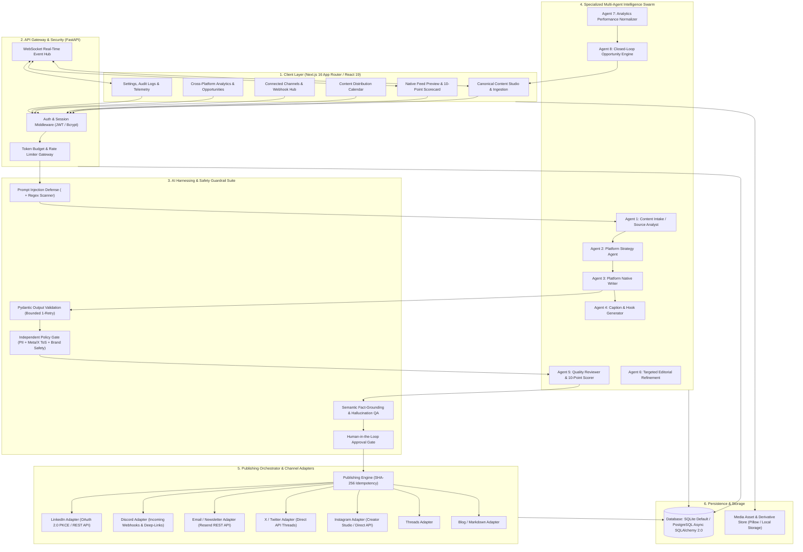

<p align="center">
  
</p>

<h1 align="center">Lisa — AI Content Distribution & Repurposing Platform</h1>

<p align="center">
  <strong>Create once. Adapt intelligently. Publish everywhere possible. Learn from performance.</strong>
</p>

<p align="center">
  <a href="https://opensource.org/licenses/MIT"></a>
  <a href="https://fastapi.tiangolo.com"></a>
  <a href="https://nextjs.org"></a>
  <a href="https://www.sqlalchemy.org"></a>
  <a href="backend/tests"></a>
  <a href="docs/AI_HARNESSING_AND_GUARDRAILS.md"></a>
  <a href="PRODUCT_SPEC.md"></a>
</p>

---

## Project Overview

**Lisa** is an enterprise-grade AI content operations operating system (OS). Rather than acting as a generic chat wrapper that generates generic captions, Lisa ingests canonical long-form content, decomposes its core narrative and quantitative facts, and intelligently adapts it into native, platform-tailored publication formats across **LinkedIn**, **X (Twitter)**, **Instagram**, **Discord**, **Threads**, **Email Newsletters**, and **Blogs**.

Lisa strictly enforces your brand voice and style rules, subjects every generated draft to an automated 10-point quality scorecard and semantic fact-grounding guardrail, mandates human-in-the-loop approval, dispatches live posts through real platform APIs and webhooks, and closes the feedback loop by transforming real audience performance metrics into new repurposing opportunities.

### 4-Stage Core Workflow
* **Stage 1 — AI Ingestion & Platform Adaptation:** Lisa extracts the core narrative, thesis, and quantitative facts from your source content and generates platform-native variants — applying the optimal hook, formatting, length, and style for each target network.
* **Stage 2 — Automated Quality & Guardrail Auditing:** Before human review, deterministic safety checks enforce character limits, aspect ratios, banned clichés, PII redaction, and semantic fact-grounding against source facts.
* **Stage 3 — Human Review & Approval:** Editors review posts inside native feed simulators, inspect 10-point scorecard metrics, make inline edits, and explicitly approve variants for publication.
* **Stage 4 — Closed-Loop Performance Learning:** Lisa tracks cross-platform engagement, normalizes impressions and interaction rates, and suggests high-impact repurposing angles back into the content studio.

### System Architecture Diagram


---

## Features

### Brand Intelligence & Dynamic Voice Profiles
- Centralized brand guidelines: voice characteristics, tone spectrum, core content pillars, audience personas, and prohibited terms.
- Dynamic prompt registry (`platform_voice_profiles`) allowing per-platform tone, emoji density, and banned pattern overrides without code changes.

### Multi-Agent Content Generation Pipeline
- Coordinated 8-agent swarm executing specialized editorial tasks in sequence:
  - Source decomposition, angle selection, platform-native drafting, hook/caption synthesis, automated scoring, and revision.
- Parallel generation for all selected channels in a single workflow.

### 10-Point QA Scorecard & Fact-Grounding Engine
- Every draft is evaluated across 10 objective quality metrics (Hook Strength, Brand Voice Match, Formatting Compliance, Value Density, Engagement CTA, Readability, Platform Fit, Banned Cliché Penalty, Specificity, Structure).
- Semantic fact extractor flags unverified quantitative claims against the original source facts.

### Omnichannel Publishing & Native Feed Simulators
- Native feed previews simulating UI layouts for LinkedIn, X/Twitter, Instagram, Discord, Threads, Email, and Blog.
- Immediate dispatch with SHA-256 idempotency to prevent duplicate publication.
- Platform Adapters:
  - **LinkedIn:** Mode A direct API dispatch with OAuth 2.0 PKCE flow.
  - **Discord:** Verified Incoming Webhook validation (`GET /api/webhooks/{id}/{token}`), rate-limit backoff (HTTP 429 `Retry-After`), and canonical deep-link generation (`https://discord.com/channels/{guild_id}/{channel_id}/{message_id}`).
  - **X (Twitter):** Single tweet and sequential thread formatting (1/N) within 280-character boundaries.
  - **Instagram:** Aspect ratio validation (1:1 and 4:5) with Creator Studio and Direct API modes.
  - **Threads, Email, and Blog:** Standardized adapter protocols with custom payload builders.

### Distribution Calendar & Scheduling
- Visual calendar interface displaying scheduled, published, and queued jobs across all connected workspaces.
- Rescheduling, cancellation, and execution status tracking.

### Closed-Loop Analytics & Content Opportunities
- Cross-platform metric normalization (impressions, clicks, shares, saves, engagement rates).
- Automated opportunity engine identifying breakout posts and recommending actionable repurposing angles.

### Real-Time Streaming & WebSockets
- Real-time generation progress and system notifications streamed over real-time WebSockets (`/ws/workspaces/{id}`).

---

## Technologies Used

| Layer | Technology | Details |
|---|---|---|
| **Backend Framework** | **FastAPI** (Python 3.11+) | Async ASGI framework, dependency injection, automatic OpenAPI documentation |
| **ORM & Database** | **SQLAlchemy 2.0 Async** | SQLite (`aiosqlite`) for local development, PostgreSQL (`asyncpg`) for production |
| **Data Validation** | **Pydantic v2** | Strict model validation, type safety, and JSON schema output enforcement |
| **Authentication & Security** | **PyJWT & Passlib (Bcrypt)** | JWT token lifecycle, envelope encryption for tokens at rest, permission dependencies |
| **HTTP Client** | **HTTPX** | Fully async outbound network client for platform API and webhook dispatch |
| **Image Processing** | **Pillow (PIL)** | Aspect ratio conversion, smart image resizing, and metadata extraction |
| **Frontend Framework** | **Next.js 16 (App Router)** | Modern React 19 architecture with server/client components and fast routing |
| **Styling & Icons** | **TailwindCSS & Lucide React** | Premium dark-mode glassmorphic interface, responsive components, micro-animations |
| **Real-Time Gateway** | **WebSockets** | Asynchronous bidirectional communication for live generation and notifications |
| **Testing & CI** | **Pytest & AnyIO** | 100% async test suite covering endpoints, adapters, and red-team safety guardrails |

---

## AI Tools/Models Used and Their Purpose

### Supported LLM Providers & Models
Lisa utilizes a tiered model routing architecture to optimize for both generation velocity and rigorous analytical quality:

1. **Groq (Primary High-Throughput Engine):**
   - **Model:** `llama-3.3-70b-versatile`
   - **Purpose:** Powers high-velocity multi-agent drafting, platform style adaptation, caption synthesis, and rapid variant iteration with sub-second token generation latency.
2. **OpenAI (Precision Analytical Engine):**
   - **Model:** `gpt-4o-mini`
   - **Purpose:** Powers semantic fact-grounding, policy validation, red-team prompt injection audits, and structured editorial scorecard evaluations.

### The 8 Specialized Agents
```
Canonical Source Text
         │
         ▼
[Agent 1: Content Intake Analyst]       ── Extract core thesis, entities, quantitative claims
         │
         ▼
[Agent 2: Platform Strategy Agent]       ── Determine platform angle, format, and structure
         │
         ▼
[Agent 3: Platform Native Writer]       ── Write native platform draft within character limits
         │
         ▼
[Agent 4: Caption & Hook Generator]     ── Synthesize high-CTR hooks and tailored CTAs
         │
         ▼
[Agent 5: Quality Reviewer & Scorer]    ── 10-point scorecard evaluation + cliché penalty
         │
   Score < 0.70?
      ├── Yes ──► [Agent 6: Editorial Refinement Agent] ──► (Targeted 1-retry rewrite)
      │                                                              │
      └── No  ───────────────────────────────────────────────────────┘
         │
         ▼
[Fact-Grounding & Human Approval]       ── Zero-hallucination verification + human sign-off
         │
         ▼
[Omnichannel Publishing Dispatch]       ── Dispatched via LinkedIn, Discord, Resend, X, etc.
         │
         ▼
[Agent 7: Analytics Normalizer]         ── Normalizes cross-platform impressions, clicks, shares
         │
         ▼
[Agent 8: Opportunity Engine]           ── Detects breakout posts & recommends new content briefs
         │
         └───────────────────────────────► Loops back into Canonical Content Studio
```
- **Agent 1 (Intake Analyst):** Deconstructs source documents, isolating key arguments, statistics, and verifiable claims.
- **Agent 2 (Platform Strategist):** Selects optimal content angles and delivery formats per target channel.
- **Agent 3 (Platform Writer):** Generates full-length drafts conforming to platform length boundaries, whitespace pacing, and layout norms.
- **Agent 4 (Hook Generator):** Crafts arresting scroll-stopping opening lines and engagement hooks.
- **Agent 5 (Quality Reviewer):** Audits drafts against 10 objective scoring metrics, imposing strict penalties for AI clichés and empty filler.
- **Agent 6 (Editorial Refinement):** Performs surgical rewrites addressing specific scorecard deficits.
- **Agent 7 (Analytics Normalizer):** Normalizes heterogeneous metrics across platform APIs into unified engagement ratios.
- **Agent 8 (Opportunity Engine):** Analyzes historical engagement trends to synthesize actionable content repurposing briefs.

### AI Safety Guardrail Suite
- **Prompt Injection Shield (FR-BRAND-005):** User inputs and external context are wrapped in `<untrusted_content>` tags and pre-screened with regex detection against prompt-override signatures.
- **Strict Pydantic Schema Enforcement:** Model outputs are strictly parsed into typed Pydantic models with bounded 1-retry correction on malformed structures.
- **Independent Policy Gate:** Automated redaction scanning for PII (emails, phone numbers, identifiers) and Meta/X ToS engagement bait violations.
- **Semantic Hallucination Prevention:** Verifies that all quantitative claims in generated variants are grounded in source content facts before enabling approval.
- **Token Budget Ceilings:** 15,000-token caps per generation job prevent runaway revision loops and runaway API costs.

---

## Setup/Installation Instructions

### Prerequisites
- **Python 3.11+**
- **Node.js 18+ & npm**

### 1. Clone the Repository
```bash
git clone https://github.com/Yuyutsu01/Lisa.git
cd Lisa
```

### 2. Backend Setup
```bash
cd backend
python -m venv venv

# Windows:
.\venv\Scripts\activate
# Linux / macOS:
source venv/bin/activate

pip install -r requirements.txt
cp .env.example .env   # Set GROQ_API_KEY (or OPENAI_API_KEY)
uvicorn app.main:app --host 0.0.0.0 --port 8000 --reload
```
> **Note:** Lisa auto-initializes its SQLite database (`lisa.db`) on startup. Interactive API documentation is available at `http://localhost:8000/docs`.

### 3. Frontend Setup
In a separate terminal window:
```bash
cd frontend
npm install
npm run dev
```
> The dashboard will be accessible at `http://localhost:3000`.

### 4. Core Environment Variables

#### Backend (`backend/.env`):
```env
ENVIRONMENT=development
SECRET_KEY=generate_a_secure_random_64_character_hex_string_here
DATABASE_URL=sqlite+aiosqlite:///./lisa.db
BACKEND_CORS_ORIGINS=["http://localhost:3000", "http://127.0.0.1:3000"]
GROQ_API_KEY=your_groq_api_key_here
GROQ_MODEL=llama-3.3-70b-versatile
# Optional:
OPENAI_API_KEY=your_openai_api_key_here
OPENAI_MODEL=gpt-4o-mini
```

#### Frontend (`frontend/.env.local`):
```env
NEXT_PUBLIC_API_BASE_URL=http://localhost:8000/api/v1
NEXT_PUBLIC_WS_BASE_URL=ws://localhost:8000/api/v1
```

---

## Usage

### The Multi-Platform Publishing Challenge
Cross-posting the same link or generic caption across platforms hurts reach and brand perception:
* **Tone & Structure Mismatch:** Professional LinkedIn audiences expect career takeaways and whitespace pacing, X (Twitter) requires punchy 280-character hooks or threaded narratives (1/N), Discord needs community-centric announcements with channel discussion prompts, and Email newsletters demand structured long-form readability.
* **Repetitive Manual Overhead:** Manually rewriting, reformatting, checking character limits, and posting into 5+ different creator dashboards takes hours for every single piece of content.
* **Hallucination & Inconsistency Risks:** Standard copy-pasted LLM summaries lose critical context or invent unverifiable statistics.

### Key Usage: How Lisa Posts to Multiple Platforms Efficiently

Lisa solves the distribution bottleneck by turning one canonical source into platform-native, fact-grounded publications in a single automated workflow:

```
[1. Canonical Source Input]
(Long-form article, podcast transcript, PR launch note, or internal memo)
                     │
                     ▼
[2. Parallel Specialized Multi-Agent Adaptation]
 ├── LinkedIn Agent    ──► Professional hook, whitespace formatting, career takeaways
 ├── X / Twitter Agent ──► Scroll-stopping hook, sequential thread (1/N), 280-char strict limits
 ├── Discord Agent     ──► Formatted community announcement for designated channels
 ├── Email Agent       ──► Subject line, preview hook, structured newsletter body (Resend)
 ├── Instagram Agent   ──► High-CTR caption, visual carousel copy, relevant hashtags
 └── Blog/Thread Agent ──► Clean markdown article & conversational dispatches
                     │
                     ▼
[3. Automated Quality Scorecard & Semantic Fact-Grounding]
(Verifies claims against source facts + penalizes AI clichés + scores formatting)
                     │
                     ▼
[4. Unified Side-by-Side Feed Simulator & Human Review]
(Review, edit, and approve all platform variants on ONE screen)
                     │
                     ▼
[5. One-Click Omnichannel Dispatch & Deep-Linking]
(Idempotent direct publishing via LinkedIn API, Discord Webhook, Resend Email, etc.)
                     │
                     ▼
[6. Closed-Loop Performance Learning]
(Normalizes engagement data across networks to recommend future repurposing angles)
```

#### 1. Single Source of Truth ("Create Once")
Instead of writing 5 separate drafts from scratch, enter or paste your long-form article, technical breakdown, or product announcement once in `/content`. Lisa extracts core arguments, key facts, and quantitative claims automatically.

#### 2. Network-Native Adaptation (Intelligent Rewriting)
Dedicated agents adapt your content specifically for each platform's style and constraints:
* **LinkedIn:** Thought-leadership hooks, clean whitespace pacing, and professional takeaways.
* **X (Twitter):** Single posts or multi-part sequential threads (1/N) engineered to fit strict 280-character boundaries.
* **Discord:** Formatted markdown community announcements dispatched directly to specified server channels.
* **Email & Newsletter:** Compelling subject line, preview snippet, and structured email body dispatched via Resend.
* **Instagram:** High-intent visual captions and context-driven hashtag curation.
* **Blog / Threads:** Markdown-formatted articles and conversational micro-posts.

#### 3. Automated Fact-Grounding & 10-Point QA
Before you publish, Lisa's guardrails run deterministic quality checks:
* **Semantic Fact Grounding:** Flags and prevents hallucinated statistics or unverified claims by matching against your source text.
* **10-Point Scorecard:** Audits Hook Strength, Brand Voice, Readability, Platform Fit, and Structure while penalizing empty AI buzzwords.

#### 4. Unified Feed Simulators (Review on One Screen)
Inspect simulated live feeds for LinkedIn, X, Discord, Instagram, and Email side-by-side in `/content/[id]/variants`. Make inline copy adjustments or trigger targeted 1-click rewrites without opening multiple browser tabs.

#### 5. One-Click Omnichannel Publishing & Permalinks
* **Real Platform APIs & Webhooks:** Direct dispatch to LinkedIn (REST API with OAuth 2.0 PKCE), Discord (verified incoming webhooks), and Email (Resend REST API).
* **SHA-256 Idempotency:** Prevents accidental double-posts across all channels.
* **Canonical Deep-Links:** Click "View Live Post" to immediately open your published post on LinkedIn or Discord via its canonical permalink.

#### 6. Closed-Loop Performance Learning
Lisa aggregates cross-platform metrics (impressions, clicks, shares, engagement) into `/analytics`, automatically surfacing top-performing themes and generating fresh repurposing angles.

---

### Step-by-Step User Walkthrough

1. **Log In:**
   - Sign in at `http://localhost:3000/login` with your credentials (e.g. `admin@lisa.ai` / `Password123!`).
2. **Configure Brand Voice (`/brand`):**
   - Set your tone adjectives, content pillars, audience personas, and prohibited keywords to guarantee consistent brand identity across all platforms.
3. **Connect Distribution Channels (`/integrations`):**
   - **LinkedIn:** Connect with one-click OAuth 2.0.
   - **Discord:** Paste your channel's Incoming Webhook URL and verify the connection.
   - **Email:** Connect your Resend API key and sender identity via the dedicated modal.
4. **Ingest Canonical Content (`/content`):**
   - Click **"New Source"**, paste your core article or transcript, select target networks, and click **"Generate Multi-Platform Variants"**.
5. **Inspect, Edit & Approve (`/content/[id]/variants`):**
   - Review drafts in native feed simulators, check the 10-point scorecard, make inline edits, and click **"Approve"**.
6. **Publish & Track (`/calendar` & `/analytics`):**
   - Click **"Publish Now"** to dispatch immediately to connected platforms and track live engagement.

---

## Project Structure

```
Lisa/
├── backend/                             # FastAPI Async Application Root
│   ├── app/
│   │   ├── agents/                      # Multi-Agent Intelligence Swarm
│   │   │   ├── intake.py                # Agent 1: Content Intake & Claim Extraction
│   │   │   ├── strategy.py              # Agent 2: Platform Strategy & Angle Selection
│   │   │   ├── adaptation.py            # Agent 3: Native Platform Variant Writer
│   │   │   ├── qa.py                    # Agent 5: 10-Point Scorecard Reviewer
│   │   │   ├── editorial.py             # Agent 6: Surgical Editorial Refinement
│   │   │   ├── analytics.py             # Agent 7: Performance Metric Normalization
│   │   │   ├── recommendation.py        # Agent 8: Closed-Loop Opportunity Engine
│   │   │   └── pipeline.py              # Generation Pipeline Orchestrator
│   │   ├── api/
│   │   │   ├── deps.py                  # Auth, Session & Permission Dependencies
│   │   │   └── v1/                      # REST API Endpoints (v1)
│   │   │       ├── auth.py              # Authentication & User Registration
│   │   │       ├── workspaces.py        # Workspace Management & Membership
│   │   │       ├── brands.py            # Brand Profiles & Knowledge Docs
│   │   │       ├── sources.py           # Content Sources & Versioning
│   │   │       ├── variants.py          # Variant Review, Approval & Editing
│   │   │       ├── connections.py       # Social Account Connections
│   │   │       ├── discord_connection.py# Discord Webhook Verification Endpoint
│   │   │       ├── email_connection.py  # Resend Email Connection Endpoint
│   │   │       ├── linkedin_oauth.py    # LinkedIn OAuth 2.0 State Machine
│   │   │       ├── publishing.py        # Immediate Publishing & History
│   │   │       ├── calendar.py          # Distribution Calendar & Scheduling
│   │   │       ├── analytics.py         # Performance Metrics & Opportunities
│   │   │       ├── ws.py                # Real-Time WebSocket Event Hub
│   │   │       └── router.py            # API v1 Central Router Aggregator
│   │   ├── core/
│   │   │   ├── config.py                # Environment Settings (Pydantic Settings)
│   │   │   └── security.py              # JWT Encoding/Decoding & Password Hashing
│   │   ├── db/
│   │   │   └── session.py               # Async SQLAlchemy Engine & Session Factory
│   │   ├── models/                      # SQLAlchemy 2.0 Declarative ORM Models
│   │   │   ├── user.py                  # Users, Sessions & Refresh Tokens
│   │   │   ├── workspace.py             # Workspaces, Members & Role Enums
│   │   │   ├── brand.py                 # Brand Profiles & Style Rules
│   │   │   ├── content.py               # Canonical Content Sources & Assets
│   │   │   ├── variant.py               # Content Variants & Status Enums
│   │   │   ├── connection.py            # Connected Accounts & Published Records
│   │   │   ├── publishing_job.py        # Scheduled & Executed Publishing Jobs
│   │   │   └── analytics.py             # Performance Metrics & Opportunities
│   │   ├── publishing/                  # Platform Adapter Orchestration Layer
│   │   │   ├── base.py                  # PlatformAdapter Protocol Definition
│   │   │   ├── registry.py              # Adapter Registry & Lookup Engine
│   │   │   ├── service.py               # Publishing Execution Service
│   │   │   ├── discord.py               # Discord Webhook Adapter (Rate Limits, Deep Links)
│   │   │   ├── linkedin.py              # LinkedIn REST API Adapter
│   │   │   ├── x.py                     # X / Twitter Thread Adapter
│   │   │   ├── instagram.py             # Instagram Media / Creator Studio Adapter
│   │   │   └── other_adapters.py        # Email (Resend), Threads & Blog Adapters
│   │   └── schemas/                     # Pydantic v2 Request/Response Schemas
│   ├── tests/                           # Pytest Async Test Suite
│   ├── migrate_analytics.py             # Idempotent Database Schema Migration Script
│   └── requirements.txt                 # Backend Python Dependencies
│
├── frontend/                            # Next.js 16 App Router Frontend
│   ├── app/                             # App Router Pages & API Routes
│   │   ├── (auth)/login/                # User Authentication
│   │   ├── (auth)/register/             # User Registration
│   │   ├── content/                     # Content Studio & Creation
│   │   ├── content/[id]/variants/       # Feed Simulator, QA Review & Publishing
│   │   ├── calendar/                    # Content Distribution Calendar
│   │   ├── integrations/                # Connected Accounts & OAuth Management
│   │   ├── analytics/                   # Performance Dashboards & Opportunities
│   │   ├── brand/                       # Brand Voice & Knowledge Base
│   │   ├── workspaces/                  # Workspace Switcher & Member Management
│   │   └── settings/                    # Account, Team & Audit Settings
│   ├── components/                      # Reusable UI Components
│   │   ├── AppLayout.tsx                # Master Dashboard Shell & Navigation
│   │   ├── DiscordConnectModal.tsx      # Purpose-Built Discord Webhook Modal
│   │   ├── EmailConnectModal.tsx        # Purpose-Built Resend Email Modal
│   │   ├── EmailRecipientModal.tsx      # Recipient Prompt Modal for Email Publishing
│   │   ├── FloatingPlatformLogos.tsx    # Ambient Floating Platform Logos in Hero
│   │   ├── InteractiveButton.tsx        # Styled Button with Micro-Interactions
│   │   ├── ScrollReveal.tsx             # Smooth Viewport Reveal Animations
│   │   └── AIGenerationStreaming.tsx    # Real-Time Generation Progress Display
│   ├── lib/
│   │   └── api.ts                       # Typed Central API Client & Domain Models
│   ├── package.json                     # Frontend Dependencies & Scripts
│   └── tailwind.config.ts               # Design System Tokens & Glassmorphism Styles
│
├── docs/                                # Technical Documentation
│   ├── AI_HARNESSING_AND_GUARDRAILS.md  # Detailed AI Safety & Harnessing Specification
│   └── PRODUCT_SPEC.md                  # Comprehensive Engineering Product Spec
├── PRODUCT_SPEC.md                      # Master Product & Technical Specification
└── README.md                            # Main Project Documentation
```

---

## Any Other Important Information About the Project

### Core Architectural Invariants
1. **Deterministic Software Enforces Hard Boundaries:**
   LLMs are strictly forbidden from acting as unconstrained judges of their own compliance. Boundary conditions (character limits, banned tokens, aspect ratios, PII masks, JSON schemas) are enforced deterministically by software before and after generation.
2. **Fabricated-Success & Provenance Invariant:**
   Lisa never writes synthetic live URLs (e.g. `mock_...`) or logs phantom published records without verified API acknowledgement from remote networks. Metrics that cannot be polled carry explicit `metrics_source = "unavailable"` tags.
3. **Human-in-the-Loop Governance:**
   Autonomous posting is strictly disabled by default. Every post requires explicit human review and approval unless an active, unexpired 30-day `TrustedAutomationRule` has been intentionally configured by a workspace owner.
4. **Credential Isolation & Envelope Security:**
   OAuth refresh tokens and incoming webhook URLs are stored in the database isolated from read schemas (`ConnectedAccountRead` never exposes credential fields) and require encryption before transit.

### Platform & Webhook Integrations
- **Discord Webhook Connection & Deep-Links:**
  - **Connection Handshake:** Webhooks are verified on creation via Discord's metadata endpoint (`GET /api/webhooks/{id}/{token}`). Invalid or non-existent URLs are rejected immediately.
  - **Canonical Message Deep-Links:** Since Discord's message creation response omits `guild_id`, Lisa extracts and caches the `guild_id` during connection handshake to construct canonical permalinks:
    `https://discord.com/channels/{guild_id}/{channel_id}/{message_id}`.
  - **Rate-Limiting Resilience:** Automatic detection of HTTP 429 `Retry-After` headers prevents rate penalties.
- **LinkedIn OAuth 2.0 PKCE:**
  - Secure state machine handling OAuth token exchanges, automatic token renewal, and Mode A direct API dispatch.

### Troubleshooting & Common Issues
- **Port 8000 Already in Use (`ECONNRESET` / `EADDRINUSE`):**
  If a background Python process is holding port 8000:
  ```powershell
  # Windows
  Get-Process python | Stop-Process -Force
  # Then restart
  uvicorn app.main:app --host 0.0.0.0 --port 8000 --reload
  ```
- **Supabase / PostgreSQL Column Errors:**
  If connecting to an existing PostgreSQL database created before v1.0.1, run the migration:
  ```bash
  cd backend && python migrate_analytics.py
  ```
- **Frontend TypeScript / Build Check:**
  To verify frontend type integrity without running the development server:
  ```bash
  cd frontend && npx tsc --noEmit
  ```

### Team Name
* **ASTRA**

### Team Members
* **Shivam Sharma**
* **Shreya Sah**
* **Shubham Raikwar**

### License
This project is open-source software licensed under the **[MIT License](LICENSE)**.